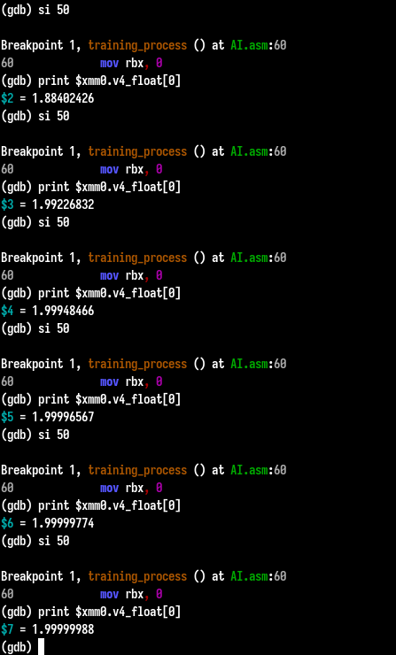

# Neural Network in Assembly (x86_64)

This project implements a simple neural network in Assembly using x86_64 with Intel syntax. The network is designed to train a single parameter (weight) to map input-output pairs based on linear regression.

## Project Overview
- **Architecture**: x86_64, Intel Syntax
- **Purpose**: Train a neural network with one parameter to learn the mapping:  
  `[1, 2, 3] → [2, 4, 6]`  
- **Learning Rate**: `0.1`  
- **Training Iterations**: `256`
- **Tools Required**: `gdb`,`ld`,`nasm`

---

## Theory
A neural network consists of two parameters called **Weight & Bias**. In this project we will stick with just **weight** to reduce the complexity. Our project aims at bringing the random value of the weight to approach **2**, cause we are mapping `[1,2,3]` -> `[2,4,6]` i.e. in simple words we are seeing what is the pattern.

## Build and Run

```bash
nasm -f elf64 -g AI.asm -o AI.o
ld AI.o -o AI
gdb ./AI
```

After opening the gdb interface just add one breakpoint to training_process and run like this:

```bash
b training_process
run
```

Then to print the value of our weight parameter use this:

```bash
print $xmm0.v4_float[0]
```

Keep checking the weight parameter after some step instruction using `si` command followed by number of steps you want to step like this:

```bash
si 100
```

## Output

I have used gdb degubber to check the value of the xmm0 register which is our weight parameter. 



<br>

## Future Endeavour
- Make this program in AT&T Syntax,
- Make it for other architecture like ARM, RISC-V
- Add bias as the other parameter
- Make a bit more complex Neural Network
